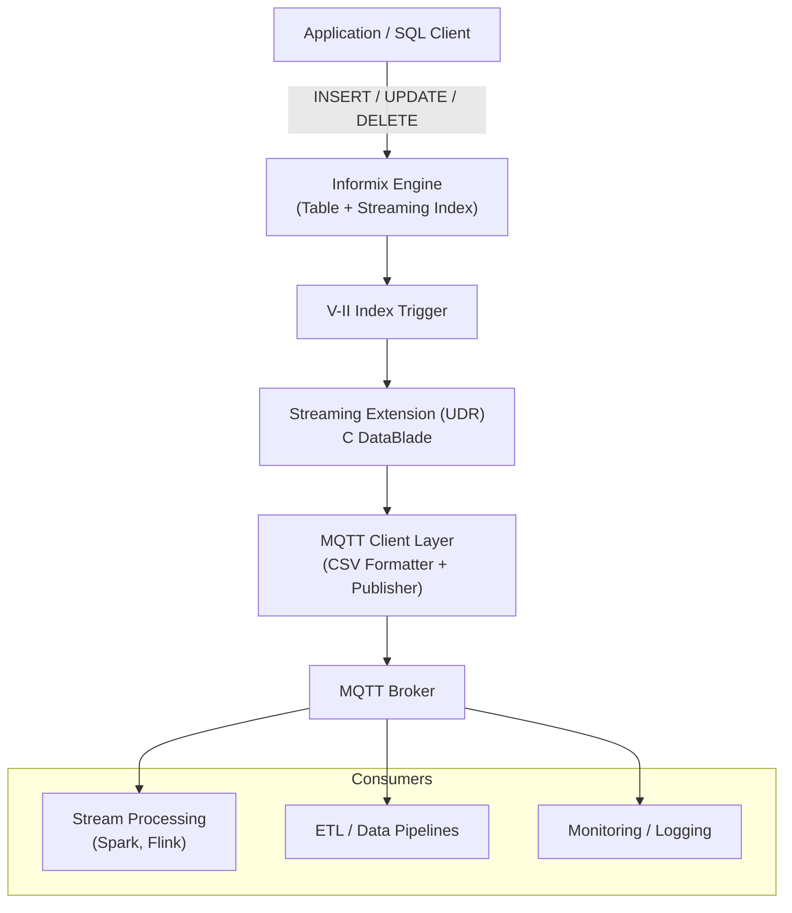

# Informix Socket Streaming

**Informix Socket Streaming** is an extension for Informix that enables real-time data streaming. Whenever rows are inserted, updated, or deleted, the changes are immediately published to an MQTT broker.

The extension uses the **MQTT v3.1.1 protocol** (older versions are not supported) and can stream data to any compatible MQTT broker, where it can be consumed by subscribing clients or downstream systems.

This project is based on a modified version of the original IBM repository (`IBM-IoT/InformixSparkStreaming`). After real-world production use, several issues and missing features were identified and addressed in this version.

---

## Features

* Real-time streaming of database changes (INSERT, UPDATE, DELETE)
* MQTT-based messaging (v3.1.1)
* Easy integration via Informix indexing mechanism
* Support for multiple common Informix data types

---

## Supported Informix Versions

This extension has been tested with:

* Informix 12.10
* Informix 14.10

> ⚠️ Other versions may work but have not been officially tested. Compatibility depends on the Informix DataBlade/extension APIs available in your installation.

---

## Supported Data Types

The following column types are currently supported:

* `CHAR`, `NCHAR`
* `VARCHAR`, `NVARCHAR`
* `SMALLINT`, `INTEGER`, `INT8`
* `SMALLFLOAT`, `FLOAT`
* `DECIMAL`
* `SERIAL`, `SERIAL8`
* `MONEY`
* `DATE` to `DATETIME YEAR TO FRACTION(5)`
* `BOOLEAN`

---

## Installation

### Prerequisites

* `autoconf`
* `automake`
* `libtool`
* `gcc`
* `git`

You must also:

* Be logged in as an Informix user
* Have the `$INFORMIXDIR` environment variable properly set

### Build & Install

Run the following script from the project root:

```bash
./setup.sh
```

This script will:

* Download required dependencies via Git
* Build the necessary libraries
* Install them into `$INFORMIXDIR/lib/`
* Build extension and install it into `$INFORMIXDIR/extend/`

---

## Setup

Before using the extension, you need to configure a secondary access method using this extension.

Run the setup script provided in:

```
examples/setup.sql
```

Execute it with:

```bash
dbaccess <database_name> examples/setup.sql
```

---

## Usage

Once the setup is complete, you can create indexes that stream data via MQTT.

### Example

```sql
CREATE INDEX i_indexname_socket
ON test(col1, col2, col3)
USING informix_socket_streaming(
    topic='mytopic',
    host='localhost',
    port='1883',
    qos='0'
);
```

### Parameters

* **topic**: MQTT topic where data will be published
* **host**: Hostname or IP address of the MQTT broker
* **port**: Port of the MQTT broker
* **qos** *(optional)*: MQTT Quality of Service level

  * If `qos > 0`, messages are sent with the persistent flag enabled

---

## Architecture

The extension leverages Informix’s **Virtual Index Interface (V-II)** to intercept table operations and stream them externally via MQTT. When a row is inserted, updated, or deleted, the index triggers a user-defined routine (UDR) that formats and publishes the change.

### High-Level Flow



---

### Key Architectural Notes

* The solution uses **index-based triggers (V-II)** instead of log-based CDC.
* Streaming is **synchronous** with the database operation (can impact write latency).
* Messages are stored in memory **row-by-row** as changes occur. When transaction commit is executed all stored changes are flushed to MQTT broker.

---

## MQTT Message Format

Each database operation generates a **CSV message** published to the configured MQTT topic.

### General Structure

Each message contains the following fields in order:

1. **Operation type**

   * `i` = INSERT
   * `u` = UPDATE
   * `d` = DELETE

2. **Hostname** (database server)

3. **Database name**

4. **Table name**

5. **Indexed column values** (in the same order as defined in the index)

### Field Formatting Rules

* **Character fields** are enclosed in double quotes (`"value"`)
* **Numeric fields** are not quoted
* **Boolean fields** are represented as `true` or `false`
* Fields are separated by commas (`,`)

---

### Examples

Assume the following index:

```sql
CREATE INDEX i_indexname_socket
ON test(col1, col2, col3)
USING informix_socket_streaming(...);
```

#### INSERT

```csv
i,myhost,mydb,test,"value1",123,true
```

#### DELETE

```csv
d,myhost,mydb,test,"value1",123,true
```

#### UPDATE

An update operation produces **two CSV lines**:

1. **New (updated) values**
2. **Previous (old) values**

```csv
u,myhost,mydb,test,"new_value",456,false
u,myhost,mydb,test,"old_value",123,true
```

> ℹ️ Notes:
>
> * The order of column values strictly follows the index definition.
> * For UPDATE operations, both the new and old states are emitted to allow downstream systems to compute differences.
> * Consumers should handle UPDATE messages as paired events (first line = new values, second line = old values).

---

## Value Proposition

A presentation explaining the architecture, use cases, and motivation behind this project is available here:

http://www.slideshare.net/deepind/informix-mqtt-streaming

It covers:

* Real-time data streaming needs
* Industry use cases (including IoT and healthcare)
* System architecture and demo implementation

---

## Examples

To learn more, check the sample SQL files in:

* `examples/`
* `examples-stores7/`

---

## Changelog

See the `CHANGELOG` file for a detailed list of changes.

---

## Troubleshooting

### High Memory Usage / Virtual Memory Exhausted

When working with large tables or high-volume transactions, this extension can require a significant amount of memory.

#### Symptoms

You may encounter errors such as:

* `Informix server virtual memory exhausted`
* Unexpected failures during index creation
* Transactions failing when processing large batches of data
* Assert files

#### When This Happens

This typically occurs in the following scenarios:

* Creating a streaming index on a **large existing table**
* Executing **bulk inserts, updates, or deletes**
* Running **large transactions** that affect many indexed rows

Because the extension processes row changes synchronously and formats messages for each affected row, memory usage can grow quickly under heavy workloads.

#### Why It Happens

* The streaming extension allocates memory for all messages into each transaction. Memory is not flushed until the transaction is closed.
* Large transactions accumulate many row events before completion

#### Recommendations

* Increase Informix **virtual memory configuration** (e.g., `SHMTOTAL`, `SHMVIRTSIZE`)
* Break large operations into **smaller batches**
* Create the index **before loading data**, when possible

